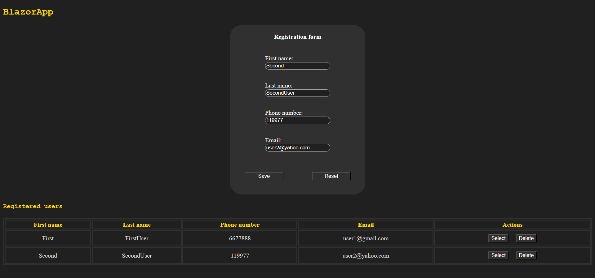

# ClientServerApp  
### Quick start
from folder `src` use 

`docker compose up -d` 

then go to http://localhost:8081  
  

  
### Desc
It is a simple  client-server  application  that  keeps  track of users (CRUD).
### Stack
NET 8; C# ASP NET Minimal Web API; Blazor; EF Core; PostgreSQL;
### Application structure
Server starts from _src/backend/ClientServerApp.WebAPI_. Default local host is _http://localhost:5000_. Also, you can use swagger _http://localhost:5000/swagger/index.html_  
UI client (blazor) use layer _src/backend/ClientServerApp.Client_
